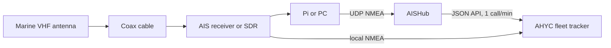

# AISHub station setup (antenna already in place)

AISHub is a cooperative: feed them your receiver's raw AIS and they give you free API access to the
whole network. This is the path from "there is an antenna on the clubhouse" to `AISHUB_USERNAME` set
on Railway.

## An antenna is not a station

An antenna receives RF and nothing more. AISHub needs decoded **raw NMEA AIS sentences** over UDP,
which means three pieces the antenna cannot supply on its own:

1. An **AIS receiver** (a purpose-built unit, or an RTL-SDR plus decoder software)
2. An **always-on host** to stream from — a Raspberry Pi at the club is ideal
3. **Internet** for outbound UDP to AISHub



The last two arrows are both worth having: AISHub returns the whole cooperative's coverage a minute
at a time, while the local NMEA stream gives club waters a few seconds of latency. The tracker
already supports each of them, separately (see [Wiring it into the tracker](#wiring-it-into-the-tracker)).

## Hardware

| Piece | Notes |
| --- | --- |
| Antenna (already in place) | Clear view of the water, as high as practical. AIS lives at 161.975 / 162.025 MHz. |
| Coax and connectors | Keep the run short; match PL-259 / SO-239 / BNC to whatever the receiver wants. |
| **AIS receiver** | Simplest is a USB unit — dAISy / dAISy HAT, AMEC, Smart Radio SR161, or anything with serial/USB NMEA out. Some also have Ethernet UDP out. |
| Budget alternative | RTL-SDR plus [AIS-catcher](https://github.com/jvde-github/AIS-catcher) on the Pi. More assembly required. |
| Host | Raspberry Pi 4/5 or a small PC, on 24/7, on the club LAN. |
| Power | PoE or a UPS. AISHub wants 90% uptime and a clubhouse breaker will eat that. |

Recommended clubhouse kit: existing antenna → USB AIS receiver → Raspberry Pi → AIS Dispatcher →
AISHub and the tracker.

## Getting NMEA off the receiver

### A. USB AIS receiver (the usual case)

1. Plug the receiver into the Pi and find the device — usually `/dev/ttyACM0` or `/dev/ttyUSB0`.
2. Serial settings are **38400 8N1**.
3. Install **AIS Dispatcher** (ARM build) from [aishub.net](https://www.aishub.net/).
4. Once AISHub sends you a host and dedicated UDP port, point Dispatcher at the receiver and at them:

```bash
./aisdispatcher -r -d /dev/ttyACM0 -s 38400 -H HOST:PORT -G
```

Use the exact host and port from their email. Flags differ between Dispatcher builds, so check
`--help` or the bundled web UI; the GUI is easier to keep configured across reboots. Dispatcher can
hold several destinations at once, which is how AISHub and the club forwarder both get fed.

### B. RTL-SDR plus AIS-catcher

1. Install AIS-catcher and confirm you are decoding ships locally (`-v`).
2. Add a UDP output aimed at the AISHub host and port they assign.
3. Optionally add a second UDP output to `127.0.0.1` for the club forwarder.

### C. Receiver with its own Ethernet port

Some receivers stream UDP NMEA themselves. Enter the AISHub host and port in the receiver's web UI
and skip Dispatcher entirely.

## Joining AISHub

1. Apply at [aishub.net/join-us](https://www.aishub.net/join-us).
2. They ask for name, email, country, station location, equipment, and station coordinates. Ours:
   **Atlantic Highlands, NJ**, clubhouse at roughly **40.4185, -74.0385** (the kiosk's `AHYC_CENTER`).
3. They reply with a **UDP host and a dedicated port**.
4. Start streaming, then email them that the feed is live.
5. They create the account, with a feed monitor and offline alerts.
6. Once the feed clears their quality gates, they issue the **username** that unlocks the API.

### Quality gates, measured over a rolling 7 days

- At least **10 vessels** average coverage
- At least **90% uptime**
- Downsampling no coarser than **60 s**
- Message delay under **10 s**
- Real receiver data only — no scraped or re-shared feeds

The AHYC waterfront should clear the vessel count comfortably if the antenna sees the harbor and the
Ambrose approaches; uptime is the gate that actually needs planning for.

### What the username buys

- JSON / XML / CSV web service: vessel positions by bounding box and/or MMSI list
- **One request per minute**, which is the constraint the poller is built around
- Optionally, aggregated raw NMEA from the whole network
- A station dashboard and alerts when the feed drops

## Wiring it into the tracker

Both paths are already implemented; neither needs code.

### AISHub API (coverage away from the harbor)

Set one variable on Railway and restart:

```text
AISHUB_USERNAME=<the username they issue>
```

The poller ([`apps/server/src/aishubWorker.ts`](../apps/server/src/aishubWorker.ts)) then spends a
one-call-per-minute budget on two jobs: a rotating bounding-box sweep of
`ny-nj-midatlantic`, `new-england` and `great-lakes`, and a targeted MMSI pull for club boats that
have reached the edge of that coverage or left it. Everything it returns is stored with
`source: "aishub"`, which is the **AISHub** checkbox on the kiosk's source filter.

Optional tuning, all with sensible defaults:

```text
AISHUB_MIN_INTERVAL_SEC=300   # gap between calls; 60 is the floor AISHub enforces
AISHUB_BBOX_INTERVAL_SEC=300  # how often the bbox sweep gets a turn
AISHUB_PERIMETER_DEG=0.5      # ~30 nm band that puts a club boat on MMSI watch
```

Check it from `GET /api/aishub/status`, or just read the kiosk's bottom ribbon: it shows the
countdown to the next refresh, the region of the last sweep, how many vessels came back, and how
many club boats are on offshore watch. Before the username exists the ribbon says so.

### Local radio (seconds of latency in club waters)

Add a second UDP destination in Dispatcher pointing at `127.0.0.1:10110` and run the forwarder in
[`deploy/ais-forwarder/`](ais-forwarder/README.md). It decodes NMEA and POSTs batches to
`/api/ais/ingest` with a shared secret, stored as `source: "radio"`:

```text
AIS_INGEST_TOKEN=<long random string>   # same value on Railway and in /etc/ahyc-ais-forwarder.env
```

Local ingest is filtered to the NYC traffic bounding box, so it is harbor context rather than wide
coverage — the two feeds are complements, not duplicates.

### AISStream

Keep `AISSTREAM_API_KEY` set if it is delivering. Nothing conflicts: each feed tags its own source
and the kiosk can filter by any of them.

## If you are starting from just the antenna

- USB AIS receiver (dAISy class) **or** an RTL-SDR kit
- Short run of decent coax, plus an adapter for the antenna connector
- Raspberry Pi 4/5 with Ethernet
- UPS, optional but it protects the uptime gate

## The next physical step

Find out what the antenna is already connected to:

- **An AIS receiver with NMEA over USB, serial or Ethernet:** nothing to buy. Go straight to
  Dispatcher and the AISHub application.
- **Only an antenna, no decoder:** buy a USB AIS receiver or an SDR first. AISHub will not approve
  an application without a live station behind it.
